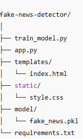
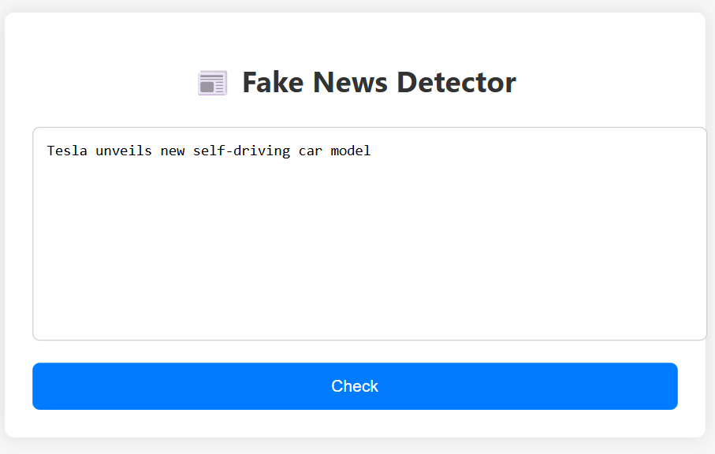
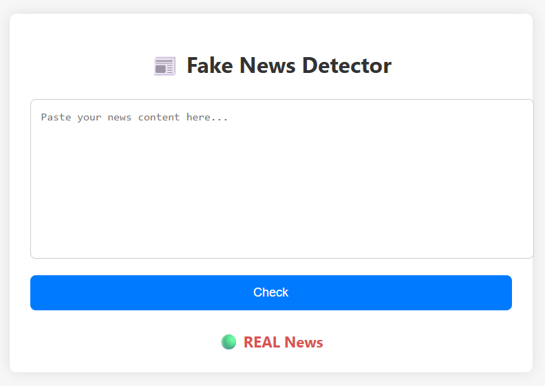

# 📰 Fake News Detector using Logistic Regression

This project is a simple yet powerful **Fake News Detector** built using **Logistic Regression**. It classifies news articles or headlines as **REAL** or **FAKE** in real time through a web interface powered by **Flask**.

---

##  Features

- Real-time prediction
- Clean and responsive user interface
- Manual or custom dataset support
- Logistic Regression classifier
- TF-IDF based feature extraction
- Fully open-source and beginner-friendly

---

##  Project Structure

---

## Dataset

A small custom dataset is used with labeled examples of real and fake news headlines. You can modify or expand the `manual_data.csv` file to improve accuracy.

Each row contains:
- `text`: News headline or article
- `label`: `1` for fake, `0` for real

---

## Model

- Algorithm: **Logistic Regression**
- Feature Extraction: **TF-IDF Vectorizer**
- Train/Test Split: 80/20 with stratified labels

---

##  Getting Started

### 1. Clone the Repository

git clone https://github.com/yourusername/fake-news-detector.git
cd fake-news-detector

### 2. Install Dependencies

pip install -r requirements.txt

### 3. Train the Model

Make sure manual_data.csv exists, then run:
python train_model.py
This will create model/fake_news.pkl.

### 4. Run the Flask App

python app.py
Visit http://127.0.0.1:5000 in your browser.

## Usage

Paste or type any news statement into the textbox

Click "Check"

## INPUT

## OUTPUT

The model will classify it as either:

🟢 REAL News

🔴 FAKE News

## Requirements

  - Python 3.7+

  - Flask

  - pandas

  - scikit-learn

  - numpy

## Future Improvements
  - Use larger, real-world datasets (e.g., Kaggle)

  - Add Naive Bayes or advanced ML models

  - Deploy to Heroku or Render for live use

  - Add database logging for submitted texts

  - Add graphs and analytics for prediction insights

